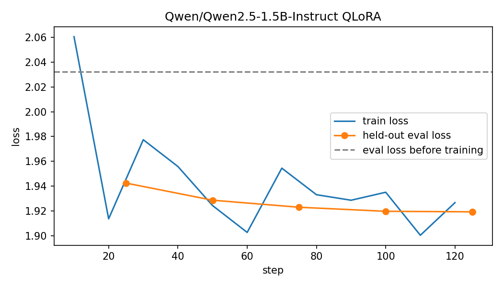

# Korean LLM Fine-tuning: QLoRA on a Single T4

A small, fully reproducible QLoRA run on a Korean instruction dataset, measured before and after on the same held-out set. The short version: held-out loss went down, but reading the answers showed the model learned style rather than facts, and became more willing to answer questions it should not answer with confidence.

## Setup

| Item | Value |
|---|---|
| Base model | Qwen/Qwen2.5-1.5B-Instruct |
| Data | beomi/KoAlpaca-v1.1a (instruction, output) |
| Split | 2,000 train / 200 held-out eval / 20 held-out samples for side-by-side review, no overlap |
| Method | QLoRA: 4-bit NF4 with double quantization, fp16 compute |
| LoRA | r=16, alpha=32, dropout=0.05, targets q/k/v/o_proj, causal-LM objective |
| Loss masking | system and user tokens masked; loss on the assistant answer only |
| Training | 1 epoch, effective batch 16, lr 2e-4 cosine, max length 512 |
| Hardware | Kaggle, one Tesla T4 |
| Libraries | torch 2.11.0, transformers 5.18.0, peft 0.21.2, bitsandbytes 0.50.2, datasets 5.0.1 |

## Results

| Metric (200 held-out examples) | Before | After |
|---|---|---|
| Eval loss | 2.032 | 1.919 |
| Perplexity | 7.63 | 6.82 |

Training took 14.1 minutes. Most of the drop happened in the first 25 steps (eval loss 2.03 to 1.94); the remaining 100 steps moved it only from 1.94 to 1.92.

## What the loss does not show

I read all 20 held-out answers before and after training (`results/samples_before_after.md`). This is a small sample and my own reading, not a validated grader, so treat it as a diagnosis rather than a score.

- **Facts did not improve.** After training the model still invents answers, sometimes more confidently than before (for example, describing a traditional holiday as a national flag, or claiming snakes have no bones).
- **It stopped refusing.** On two questions where the base model declined to answer (food storage, a legal question), the fine-tuned model gave a confident and wrong answer. For a legal question that is a regression, not a gain.
- **Language became more consistent.** The base model answered one question entirely in English and mixed Chinese into several; after training, answers stayed in Korean more often.
- **Repetition appeared** in a few answers after training, with the same sentence looping.
- **Some reference answers are outdated.** For example, one reference treats adultery as a crime in Korea, which the Constitutional Court struck down in 2015. Training on such data teaches outdated facts with confidence.

Conclusion: lower loss here mostly means the model learned to sound like the dataset. I would not ship this adapter.

## What I would change next

1. Evaluate correctness and refusal behavior directly, with a rubric and a grader validated against labeled examples, instead of relying on loss.
2. Filter or date-check the training data, especially legal, medical, and other time-sensitive answers.
3. Try the 3B model and compare with the same held-out set and the same review protocol.
4. Add repetition and refusal-rate checks as regression tests before any adapter is used.

## Reproduce

Open `korean_qlora_kaggle.ipynb` on Kaggle with the GPU T4 x2 accelerator and internet enabled, then run "Save & Run All". The notebook writes everything below to `results/`.

## Files

- `results/metrics.json`: before and after eval loss and perplexity, training time, GPU, library versions
- `results/log_history.json`: train and eval loss over steps
- `results/loss_curve.png`: the curve above
- `results/samples_before_after.md`: 20 held-out questions with the reference, before, and after answers
- `results/adapter/`: the LoRA adapter and tokenizer files

Earlier work in this repository (GPTQ and GGUF quantization scripts and a vLLM, TGI, and Transformers serving benchmark) was written but not yet run; those results are not reported here. The serving benchmark is documented in [`serving-benchmark/README.md`](serving-benchmark/README.md).
